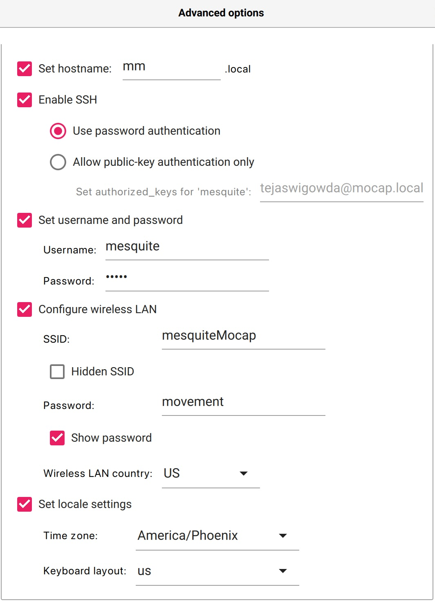

# pi-based-cam


### STEP 0: Hardware

Get a 
- [Raspberry Pi Zero](https://www.raspberrypi.com/products/raspberry-pi-zero/) (henceforth shortened as Pi Zero, Pi or rpi), and 
- a SD card (2gb should work, atleast 8gb recommended). Use these recommended options (will allow you to ssh intpo Pi to configure it):


### STEP 1: Installing Node.js and other necessary software on Pi Zero W

a. Flash a **terminal only** image of raspberry pi using [Pi OS Imager](https://www.raspberrypi.com/software/):




b. SSH into pi from a bash shell
```
ssh mesquite@mm.local 
```

c. Then install node.js and other dependencies for your system: 

```
sudo apt-get update
sudo apt-get install nodejs npm git software-properties-common
sudo apt-get install build-essential libjpeg9-dev imagemagick libv4l-dev cmake git -y
```

### STEP 2: Install mjpg-streamer

a. Run  
```sh
git clone https://github.com/jacksonliam/mjpg-streamer.git
cd mjpg-streamer/mjpg-streamer-experimental
 
make
sudo make install

```
in the rpi shell.


b. Make sure serial interface and auto-logon for root user are enabled (use sudo rapsi-config; restart to apply settings)

c. Add

```
dtoverlay=dwc2
```

to `/boot/config.txt`.

d. Add

```
dwc2
g_serial
```

to `/etc/modules`.

d. change hostname to either `mmright` or `mmleft` (depending on which hand you are using) using `sudo raspi-config` and restart.


### STEP 3: Running On Startup

write into `/etc/init.d/livestream.sh`

`sudo vi /etc/init.d/livestream.sh`

the following:

```sh
#!/bin/sh
# /etc/init.d/livestream.sh
### BEGIN INIT INFO
# Provides:          livestream.sh
# Required-Start:    $network
# Required-Stop:     $network
# Default-Start:     2 3 4 5
# Default-Stop:      0 1 6
# Short-Description: mjpg_streamer for webcam
# Description:       Streams /dev/video0 to http://IP/?action=stream
### END INIT INFO
f_message(){
        echo "[+] $1"
}
 
# Carry out specific functions when asked to by the system
case "$1" in
        start)
                f_message "Starting mjpg_streamer"
                /usr/local/bin/mjpg_streamer -b -i "input_uvc.so -f 60 -r 640x480" -o "output_http.so -w /usr/local/share/mjpg-streamer/www"
                sleep 2
                f_message "mjpg_streamer started"
                ;;
        stop)
                f_message "Stopping mjpg_streamer…"
                killall mjpg_streamer
                f_message "mjpg_streamer stopped"
                ;;
        restart)
                f_message "Restarting daemon: mjpg_streamer"
                killall mjpg_streamer
                /usr/local/bin/mjpg_streamer -b -i "input_uvc.so -f 60 -r 640x480" -o "output_http.so -w /usr/local/share/mjpg-streamer/www"
                sleep 2
                f_message "Restarted daemon: mjpg_streamer"
                ;;
        status)
                pid=`ps -A | grep mjpg_streamer | grep -v "grep" | grep -v mjpg_streamer. | awk ‘{print $1}’ | head -n 1`
                if [ -n "$pid" ];
                then
                        f_message "mjpg_streamer is running with pid ${pid}"
                        f_message "mjpg_streamer was started with the following command line"
                        cat /proc/${pid}/cmdline ; echo ""
                else
                        f_message "Could not find mjpg_streamer running"
                fi
                ;;
        *)
                f_message "Usage: $0 {start|stop|status|restart}"
                exit 1
                ;;
esac
exit 0
```


Enable using:

```sh
sudo chmod 755 /etc/init.d/livestream.sh
sudo update-rc.d livestream.sh defaults
```


You can now start the stream using:

```sh
sudo service livestream start
```

and check status using:

```sh
sudo service livestream status
```


### STEP 4: Send orientation data and hand image

```sh
git clone https://github.com/tejaswigowda/pi-based-cam
cd pi-based-cam
npm install ws net request mjpeg-consumer getmac
node server.js <ip> <port>

```

### STEP 5: Autostart

Put this in your `~/.bashrc`:

```sh
cd /home/mesquite/pi-based-cam
node server.js <ip> <port>

```